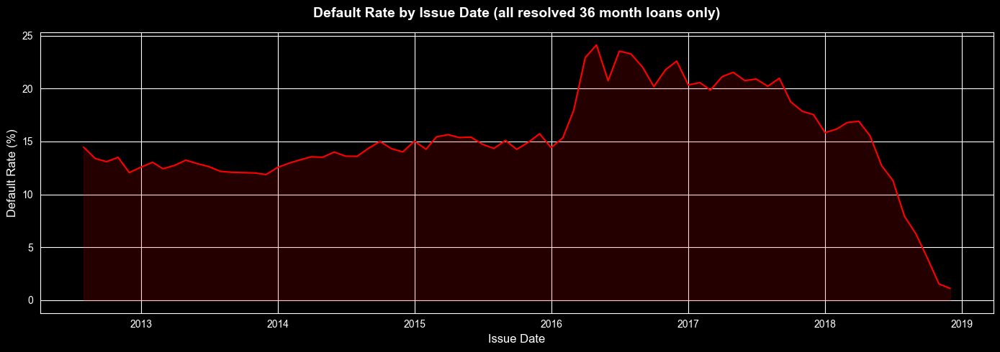
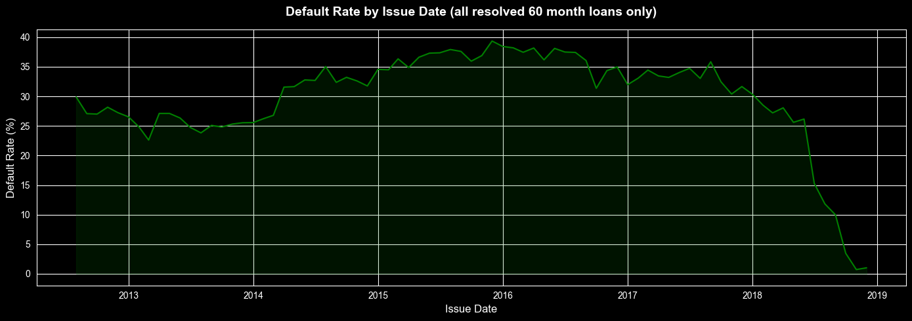

## Insight: 60-Month Loans Default at Nearly Double the Rate of 36-Month Loans

- The 60-month cohort consistently runs at higher default levels. 
- The longer repayment window introduces higher variance related to financial circumstances that could result in defaults such as:
  - job loss
  - medical events
  - economic downturns
- These effects likely compound over 5 years significantly more than 3 years.

## Actionable Recommendation: Tighten Eligibility for 60-Month Loans Using Known Protective Factors

- Eliminating 60 months loans is not a practical solution
- There are some indicators of lower default risk
  - homeownership status
  - borrowers with a mortgage default at a noticeably lower rate than renters
  - mortgage holders likely manage long-term debt obligations well
- Could mitigate exposure by lowering loan amounts for 60-month loans
  - decreases risk of default
  - decreases exposure to defaults

In Practice:
- Relatively similar eligibility requirements for applicants with strong predictors of not defaulting, such as home-owners.
- Stricter eligibility requirements and moderately lower loan amounts for applicants that don't exhibit strong predictors for loan payoffs.

## Follow-Up: "What would the revenue impact be if we tightened 60-month eligibility?"

1. **Simulating tighter eligibility**: apply the tighter criteria retroactively against historical applications to infer how many loans would have been filtered out.
2. **Revenue vs. loss trade-off analysis**: for the loans that would have been rejected, calculate the expected interest income lost versus the charge-off losses avoided. If the avoided defaults exceed the lost interest, the policy pays for itself.
  
